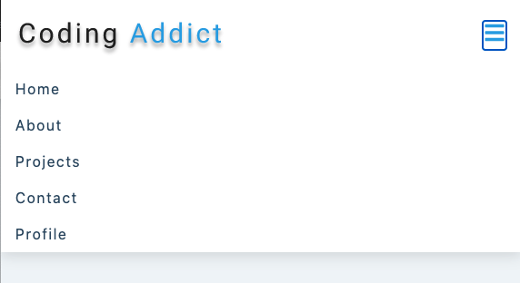

# Dynamic Navbar

This is a dynamic navbar that is responsive to the size of the page. There is a smooth animation when clicked on the toggle button. The size of the links in the navbar is proportionally to how many links there are.



## Table of Contents

|                                         |                                                               |                                                  |
| :-------------------------------------: | :-----------------------------------------------------------: | :----------------------------------------------: |
| [Project Introduction](#Dynamic-Navbar) |            [Table of Contents](#table-of-contents)            | [Development Highlights](development-highlights) |
|           [Netlify](#Netlify)           | [Description of Page Building](#Description-of-Page-Building) |       [Code Hightlights](#code-highlights)       |
| [Technologies Used](#Technologies-Used) |                      [Credit](#Credits)                       |               [License](#License)                |

## Development Highlights

- Use react useState for a dynamic navbar.
- Use react useRef and useEffect to create dynamic links height.

## Netlify

[Deployment](https://dynamic-navbar-david.netlify.app/)

## Description of Page Building

- components
    <ul>
       <li> Navbar </li>
    </ul>

## Code Highlights

Using useRef and useEffect to have a dynamic size of the links.

```
    const linksContainerRef = useRef(null)
    const linksRef = useRef(null)

    useEffect(() => {
        const linksHeight = linksRef.current.getBoundingClientRect().height;
        if (showLinks) {
            linksContainerRef.current.style.height = `${linksHeight}px`
        }
        else {
            linksContainerRef.current.style.height = "0px"
        }
    }, [showLinks])
```

Dynamically add the social icons depending on the info from data.js

```
    <ul className="social-icons">
        {social.map((socialIcon) => {
            const { id, url, icon } = socialIcon;
            return <li key={id}>
                    <a href={url}>{icon}</a>
                    </li>
        })}
    </ul>
```

## Technologies Used

- [HTML](https://developer.mozilla.org/en-US/docs/Web/HTML)
- [CSS](https://developer.mozilla.org/en-US/docs/Web/CSS)
- [Javascript](https://developer.mozilla.org/en-US/docs/Web/JavaScript)
- [React](https://reactjs.org/)
- [useState](https://reactjs.org/docs/hooks-state.html)
- [useRef](https://reactjs.org/docs/hooks-reference.html#useref)
- [useEffect](https://reactjs.org/docs/hooks-reference.html#useeffect)
- [react-icons](https://react-icons.github.io/react-icons/)

## Credits

This app was apart of a React course by John Smilga. The CSS was already made. This was the [tutorial](https://www.youtube.com/watch?v=a_7Z7C_JCyo&t=11443s) that was followed.

|                           |                                                                                                                                                                                                       |
| ------------------------- | ----------------------------------------------------------------------------------------------------------------------------------------------------------------------------------------------------- |
| **David Anusontarangkul** | [ LinkedIn](https://www.linkedin.com/in/anusontarangkul/) [ GitHub](https://github.com/anusontarangkul) |

## License

[](https://opensource.org/licenses/MIT)
